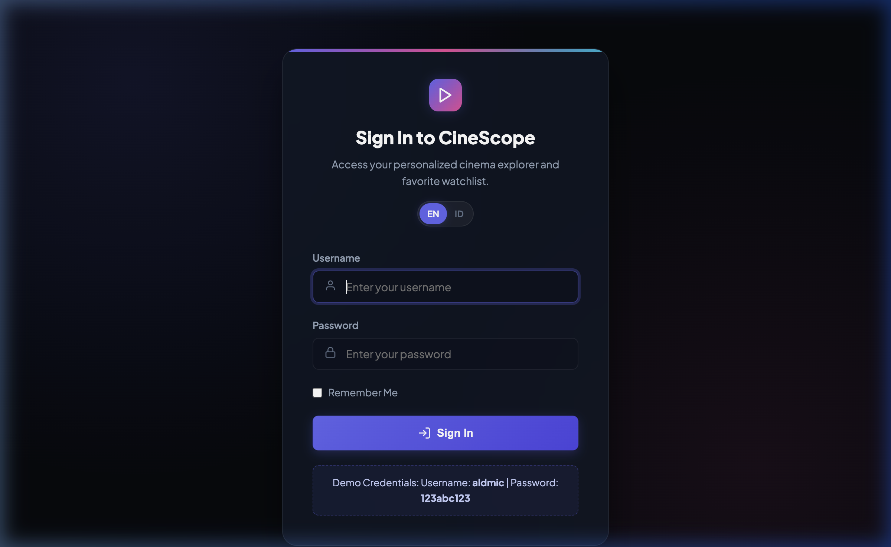
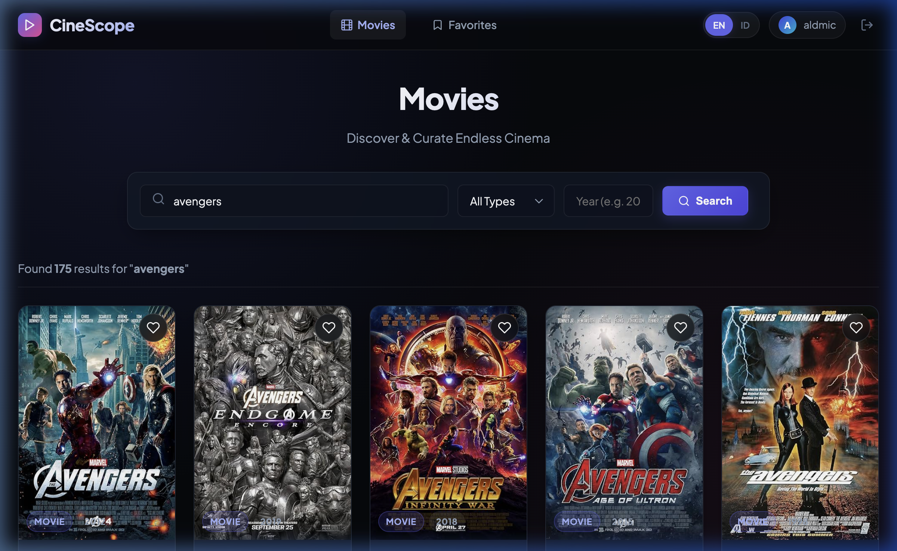
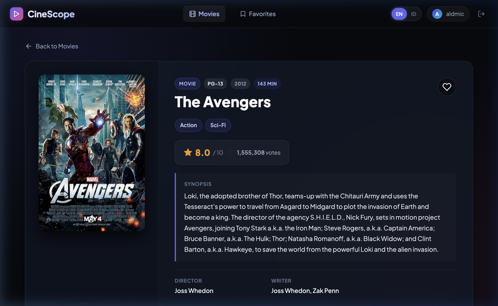
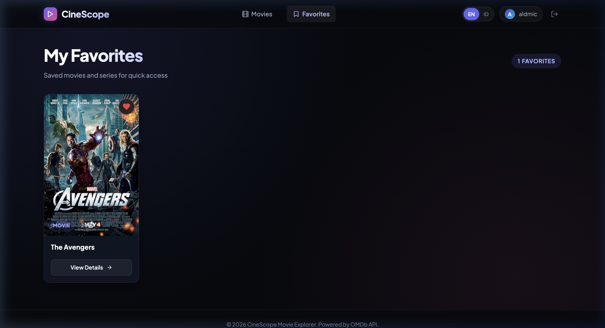

# CineScope - OMDB Movie Lists Application

A modern, high-performance cinema exploration web application built with **PHP Laravel 5.8**, **MySQL**, and the **OMDb API**. Featuring real-time search, multi-parameter filtering, infinite scroll pagination, comprehensive movie detail pages, interactive personal watchlists (favorites), and multi-language support (English & Bahasa Indonesia).

---

## 📸 Screenshots

### 1. Halaman Login

*Modern dark glassmorphic login screen with authentication validation and instant credential hints.*

---

### 2. Halaman List Movie

*Dynamic movie catalog loaded from OMDb API with live search, type filter (Movie, Series, Episode), year filter, interactive favorite buttons, and infinite scrolling.*

---

### 3. Halaman Detail Movie

*Rich cinematic detail view displaying ratings (IMDb, Rotten Tomatoes, Metacritic), plot synopsis, full cast and crew, release date, runtime, awards, and bookmark status.*

---

### 4. Halaman Favorit (Watchlist)

*Personal watchlist stored in the MySQL database per authenticated user, with instant add/remove actions.*

---

## 🛠️ Library & Dependencies

Aplikasi ini dibangun menggunakan pustaka dan stack teknologi berikut:

| Kategori | Teknologi / Pustaka | Versi / Keterangan |
|---|---|---|
| **Backend Framework** | [Laravel Framework](https://laravel.com/) | `5.8.38` (dengan patch kompatibilitas PHP 8.x modern) |
| **Bahasa Pemrograman** | PHP | `>= 7.1.3` (diuji dan kompatibel hingga PHP `8.3` / `8.4`) |
| **Database** | MySQL | Percona / MySQL Server (`omdb_movie_lists`) |
| **HTTP Client** | [Guzzle HTTP](https://github.com/guzzle/guzzle) | `~6.3` (komunikasi asinkron & tersentralisasi ke OMDb API) |
| **Authentication** | Laravel Auth & Eloquent | Custom Database Authentication via `username` & `password` |
| **Frontend Styling** | Vanilla CSS3 (Custom Design System) | Modern Dark Glassmorphism, CSS Variables, Flexbox & CSS Grid |
| **Typography** | Google Fonts | `Plus Jakarta Sans` (400, 500, 600, 700, 800) |
| **Localization** | Laravel Localization (`App::setLocale`) | Mendukung `en` (English) dan `id` (Bahasa Indonesia) |
| **Async / UI Enhancements** | Native Modern JavaScript | `IntersectionObserver` (Infinite Scroll), Fetch API, CSS Toast Notifications |

---

## 🏛️ Arsitektur Aplikasi

Aplikasi dirancang dengan prinsip **Separation of Concerns (SoC)** dan arsitektur berstandar industri:

```
                  ┌─────────────────────────────────┐
                  │          Client Browser         │
                  │  (Blade Views, Fetch API, JS)   │
                  └────────────────┬────────────────┘
                                   │ HTTP Request
                                   ▼
                  ┌─────────────────────────────────┐
                  │       Routing & Middleware      │
                  │  - Web Routes (routes/web.php)  │
                  │  - Authenticate (auth)          │
                  │  - SetLocale (Session locale)   │
                  └────────────────┬────────────────┘
                                   │
                                   ▼
                  ┌─────────────────────────────────┐
                  │           Controllers           │
                  │  - AuthController               │
                  │  - MovieController              │
                  │  - FavoriteController           │
                  │  - LocaleController             │
                  └────────┬───────────────┬────────┘
                           │               │
            Data Relations │               │ External HTTP Calls
                           ▼               ▼
        ┌─────────────────────────┐  ┌─────────────────────────┐
        │      Eloquent ORM       │  │      Service Layer      │
        │  - User (hasMany)       │  │  - OmdbService          │
        │  - Favorite (belongsTo) │  │    (Guzzle HTTP Client) │
        └────────────┬────────────┘  └────────────┬────────────┘
                     │                            │
                     ▼                            ▼
        ┌─────────────────────────┐  ┌─────────────────────────┐
        │     MySQL Database      │  │        OMDb API         │
        │  - users table          │  │   (http://omdbapi.com)  │
        │  - favorites table      │  └─────────────────────────┘
        └─────────────────────────┘
```

### 1. **Model-View-Controller (MVC) Pattern**
- **Model (`app/User.php`, `app/Favorite.php`)**: Mengelola entitas database dengan relasi satu-ke-banyak (`User hasMany Favorite`) dan validasi integritas data.
- **View (`resources/views/`)**: Antarmuka responsif berbasis Blade templating (`layouts/app.blade.php`, `auth/login.blade.php`, `movies/index.blade.php`, `movies/show.blade.php`, `favorites/index.blade.php`).
- **Controller (`app/Http/Controllers/`)**:
  - `AuthController`: Menangani alur login form, autentikasi berbasis database (`username` & `password`), regenerasi session, dan logout.
  - `MovieController`: Menangani inisialisasi query default (`avengers`), pencarian multi-parameter, detail film, dan endpoint AJAX untuk pagination.
  - `FavoriteController`: Menangani penyimpanan (`store`), penampilan (`index`), dan penghapusan (`destroy`) film favorit user via JSON API & Blade.
  - `LocaleController`: Mengganti bahasa aktif aplikasi antara Bahasa Indonesia (`id`) dan Inggris (`en`).

### 2. **Service Layer Pattern (`app/Services/OmdbService.php`)**
- Seluruh interaksi dengan OMDb API diisolasi ke dalam dedicated service class.
- Controller tidak memanggil HTTP langsung melainkan melalui `OmdbService`, memudahkan pengujian, pemeliharaan, dan penanganan timeout/error jaringan.

### 3. **Middleware Layer (`app/Http/Middleware/SetLocale.php`)**
- Menginspeksi session locale pengguna pada setiap siklus HTTP request dan mengaktifkan terjemahan yang sesuai secara otomatis.

---

## 🔑 Kredensial Pengguna

Sesuai spesifikasi, kredensial pengguna tersimpan dalam database MySQL (bukan hardcoded):

- **Username**: `aldmic`
- **Password**: `123abc123`

*Catatan: Password di-hash menggunakan algoritma `Bcrypt` standar Laravel saat migration dan seeding dijalankan.*

---

## 🚀 Panduan Instalasi & Menjalankan Aplikasi

### 1. Clone & Masuk ke Direktori Proyek
```bash
cd /Users/cahyo/Sites/projects/omdb-movie-lists
```

### 2. Konfigurasi Environment (`.env`)
Pastikan file `.env` telah memiliki konfigurasi berikut:
```env
APP_NAME=CineScope
APP_ENV=local
APP_KEY=base64:3f0hF4eYdM4qU/xS08zWcR/lE2O8aBvC7gQjW1+L9y0=
APP_DEBUG=true
APP_URL=http://127.0.0.1:8000

DB_CONNECTION=mysql
DB_HOST=127.0.0.1
DB_PORT=3306
DB_DATABASE=omdb_movie_lists
DB_USERNAME=root
DB_PASSWORD=toor

OMDB_API_KEY=5eb0687b
OMDB_BASE_URL=http://www.omdbapi.com
```

### 3. Jalankan Database Migration & Seeding
```bash
php artisan migrate:fresh --seed
```
*Perintah ini akan membuat tabel `users` dan `favorites`, serta menginput akun pengguna `aldmic` ke database MySQL.*

### 4. Jalankan Web Server Lokal
```bash
php artisan serve --port=8000
```
Buka browser di: **[http://127.0.0.1:8000](http://127.0.0.1:8000)**

---

### 🐳 Menjalankan Menggunakan Docker (Terisolasi & Paling Aman)

Aplikasi telah dilengkapi konfigurasi **Docker & Docker Compose** lengkap (PHP 7.4-FPM, Nginx, dan MySQL 8.0) sehingga tidak akan terjadi bentrok versi PHP di mesin host / cloud server:

```bash
# 1. Jalankan container di background
./docker-run.sh up

# 2. Setup database, composer, dan seeder di dalam container
./docker-run.sh setup

# 3. Akses aplikasi
# Buka di browser: http://localhost:8080 (atau http://IP_SERVER:8080)
```

Perintah praktis lainnya:
- `./docker-run.sh artisan <command>` : Menjalankan artisan di container
- `./docker-run.sh composer <command>` : Menjalankan composer di container
- `./docker-run.sh down` : Mematikan container
- `./docker-run.sh logs` : Melihat log container

---

## 🔍 Fitur Utama

1. **Proteksi Autentikasi**:
   - Seluruh halaman katalog film (`/movies`), detail film (`/movies/{id}`), dan favorit (`/favorites`) terlindungi middleware autentikasi.
   - User wajib login terlebih dahulu. Jika kredensial salah, sistem menampilkan notifikasi kesalahan yang jelas.
2. **Pencarian Film Multi-Parameter**:
   - Pencarian berdasarkan judul film (default: `avengers`).
   - Filter berdasarkan tipe: *Movie*, *Series*, atau *Episode*.
   - Filter berdasarkan tahun rilis film.
3. **Infinite Scroll & Load More**:
   - Data dimuat secara bertahap (10 film per halaman) via AJAX saat pengguna menggulir ke bawah tanpa perlu me-reload halaman.
4. **Halaman Detail Film Lengkap**:
   - Poster resolusi tinggi, rating IMDb, Rotten Tomatoes, Metacritic, sinopsis (plot), sutradara, penulis, aktor utama, genre, durasi, negara, bahasa, dan box office.
5. **Sistem Watchlist / Favorit Interaktif**:
   - Pengguna dapat menandai (bookmark) film dari katalog maupun halaman detail dengan satu klik.
   - Film tersimpan secara persisten di database MySQL per user.
   - Penghapusan dari daftar favorit menggunakan interaksi halus (animasi kartu fade-out & toast notification).
6. **Multi-Bahasa (English & Bahasa Indonesia)**:
   - Pengalihan instan bahasa seluruh antarmuka aplikasi melalui tombol toggle `EN` / `ID` di navbar maupun halaman login.

---

## 🧪 Pengujian Otomatis

Aplikasi dilengkapi dengan script verifikasi pengujian end-to-end yang menguji 10 skenario:
1. `GET /login` (Rendering form login)
2. `POST /login` dengan data salah (Verifikasi pesan kesalahan kredensial)
3. `POST /login` dengan kredensial `aldmic` / `123abc123` (Verifikasi session & redirect)
4. `GET /movies` (Pengecekan integrasi OMDb API default query `avengers`)
5. `GET /movies/search` (Pengecekan endpoint AJAX infinite scroll)
6. `GET /movies/{imdbId}` (Pengecekan halaman detail film)
7. `POST /favorites` (Penyimpanan film ke database MySQL)
8. `GET /favorites` (Pengecekan daftar film tersimpan)
9. `GET /locale/id` (Pengecekan switch bahasa ke Bahasa Indonesia)
10. `DELETE /favorites/{imdbId}` (Pengecekan penghapusan favorit dari database)

Jalankan test suite menggunakan perintah:
```bash
python3 /Users/cahyo/.gemini/antigravity-ide/brain/27608c9d-c667-4f87-9522-486e6ad16b26/scratch/test_flow.py
```
Hasil:
```text
>>> ALL 10 END-TO-END VERIFICATION CHECKS PASSED PERFECTLY! <<<
```

---

## 📄 Lisensi
Aplikasi ini dikembangkan untuk kebutuhan evaluasi teknis dan pembelajaran di bawah lisensi open source [MIT License](LICENSE).
